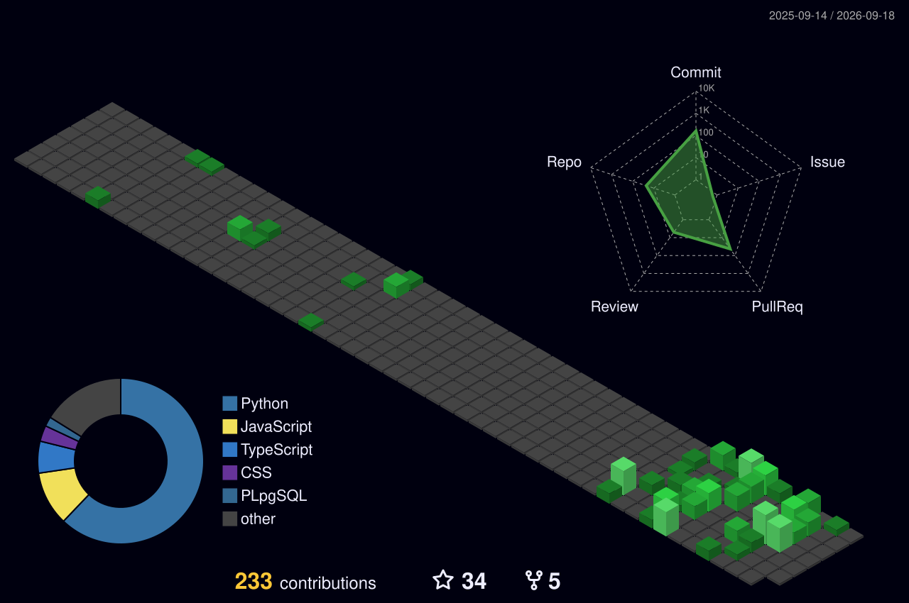

<h1 align="center">
  
</h1>

<div align="center">
  <a href="https://vercel.com/sonu-suman-ojhas-projects" title="Portfolio"></a>
  <a href="https://www.linkedin.com/in/sonu-suman-ojha-81a443301/" title="LinkedIn"></a>
  <a href="https://x.com/SonusumanO" title="X (Twitter)"></a>
  <a href="https://www.instagram.com/nxt__sonu__/" title="Instagram"></a>
  <a href="https://stackoverflow.com/users/26817244"></a>
  <a href="https://codepen.io/Sonusuman"></a>
  <a href="https://www.facebook.com/profile.php?id=148566998800"></a>
</div>

## 👨🏻‍💻 About Me


```javascript
const Sonu = {
    Education: "BTech CSE ",
    Passion: ["Web Development", "Data Science", "Gen AI"],
    Website: "Sonu.vercel.app",
    Focused: "True"
};
```
<p align="left">
  A passionate <b>Data Science</b> student, I strive to bridge the gap between innovative ideas and transformative technologies. My expertise includes <b>Web Development</b>, <b>Data Science</b>, <b>Gen AI</b>, and <b>Collaborative GitHub Projects</b>.
</p>

## 🛠️ Technologies & Tools
<div align="center">
  
</div>

## 📊 GitHub Statistics



<div align="center">
  
</div>

## ⌨️ My Coding Stats

<!--START_SECTION:waka-->


**🐱 My GitHub Data** 

> 📦 4.0 MB Used in GitHub's Storage 
 > 
> 🏆 2,157 Contributions in the Year 2025
 > 
> 🚫 Not Opted to Hire
 > 
> 📜 99 Public Repositories 
 > 
> 🔑 6 Private Repositories 
 > 
**I'm an Early 🐤** 

```text
🌞 Morning                547 commits         ██████░░░░░░░░░░░░░░░░░░░   23.38 % 
🌆 Daytime                787 commits         ████████░░░░░░░░░░░░░░░░░   33.63 % 
🌃 Evening                624 commits         ███████░░░░░░░░░░░░░░░░░░   26.67 % 
🌙 Night                  382 commits         ████░░░░░░░░░░░░░░░░░░░░░   16.32 % 
```
📅 **I'm Most Productive on Friday** 

```text
Monday                   311 commits         ███░░░░░░░░░░░░░░░░░░░░░░   13.29 % 
Tuesday                  294 commits         ███░░░░░░░░░░░░░░░░░░░░░░   12.56 % 
Wednesday                364 commits         ████░░░░░░░░░░░░░░░░░░░░░   15.56 % 
Thursday                 327 commits         ███░░░░░░░░░░░░░░░░░░░░░░   13.97 % 
Friday                   434 commits         █████░░░░░░░░░░░░░░░░░░░░   18.55 % 
Saturday                 297 commits         ███░░░░░░░░░░░░░░░░░░░░░░   12.69 % 
Sunday                   313 commits         ███░░░░░░░░░░░░░░░░░░░░░░   13.38 % 
```


📊 **This Week I Spent My Time On** 

```text
🕑︎ Time Zone: Asia/Kolkata

💬 Programming Languages: 
TypeScript               1 hr 11 mins        ████████████████████████░   97.06 % 
HTML                     2 mins              █░░░░░░░░░░░░░░░░░░░░░░░░   02.82 % 
Bash                     0 secs              ░░░░░░░░░░░░░░░░░░░░░░░░░   00.07 % 
CSS                      0 secs              ░░░░░░░░░░░░░░░░░░░░░░░░░   00.05 % 

🔥 Editors: 
VS Code                  1 hr 13 mins        █████████████████████████   100.00 % 

🐱‍💻 Projects: 
Smart India Hackathon 2021 hr 13 mins        █████████████████████████   100.00 % 

💻 Operating System: 
Windows                  1 hr 13 mins        █████████████████████████   100.00 % 
```

**I Mostly Code in TypeScript** 

```text
TypeScript               16 repos            ██████░░░░░░░░░░░░░░░░░░░   23.19 % 
JavaScript               12 repos            ████░░░░░░░░░░░░░░░░░░░░░   17.39 % 
C++                      6 repos             ██░░░░░░░░░░░░░░░░░░░░░░░   08.70 % 
Jupyter Notebook         4 repos             █░░░░░░░░░░░░░░░░░░░░░░░░   05.80 % 
Java                     3 repos             █░░░░░░░░░░░░░░░░░░░░░░░░   04.35 % 
```


**Timeline**


 Last Updated on 15/12/2025 18:56:39 UTC
<!--END_SECTION:waka-->


## ✍️ Random Dev Quote
<div align="center">
  
</div>

## 🎨 Tech Vibes & Inspiration :-

<p align="center">
  
  
  
</p>


## ☕️ Support My Work
<div align="left">
  <a href="https://buymeacoffee.com/sonusumanog">
    
  </a>
</div>

<p align="right">
  
</p>

  ## 🤝 Connect with the Developer :
<p align="center">
<a href="https://www.linkedin.com/in/sonu-suman-ojha/"></a>
<a href="https://mail.google.com/mail/u/0/#sent?compose=CllgCJfnbctwDxhPVGfRmDnqrrprlvwRLCZBHHbNXcdVsjrQPcrQFqtClKrfmvQqzrCVqTBHnvB"></a>
</p>

<p align="center">
  
</p>

<p align="center">
  
</p>

<p align="center">
  <i>💙 Crafted with Passion, Precision & Coffee by <b>Sonu Suman Ojha</b> ☕</i>
</p>

<div align="center">
  
</div>

